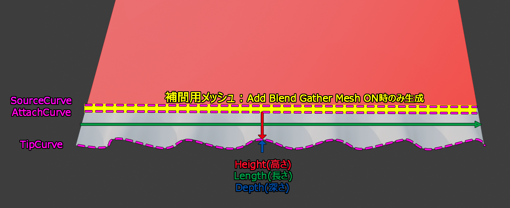

# **FrillCreate**

選択したエッジ列を基準として、Curve Modifierで対象形状へ沿わせるフリルメッシュを生成するBlenderアドオン。  
フリル本体は原点付近に短冊形状として作成し、SourceカーブをCurve Modifierに登録することで選択エッジに沿った変形を行います。  

  

# ○概要

## ○簡易的な操作方法

 1. フリルを生成したいエッジを選択し、'Generate'ボタンを押します。→アクティブコレクション内にオブジェクト群が生成されます。  
 2. 必要に応じてプリセットを選択し、各パラメータを調整します。主にBasicSettingと*LineControlで形状を作っていきます。  
 3. プリセットを保存します(option→Save Preset)。Applyを押さない限りカスタムプロパティに値が残り続けるのであくまでも任意ですが、調子が悪いとパラメータがリセットされるので推奨寄りです。  
 4. Applyを実行。  
 ①形状が確定しメッシュ化する場合は、'Apply'を押します。  
 ②Tip,Gatherカーブを3Dviewで直接編集しても、フリルメッシュはリアルタイムで形状が変化します。  
 これを安全に実行したい場合は'Apply (Keep Curve)'を実行します。(カスタムプロパティは維持しますが、パラメータ編集が無効化されます。)  
 5. メッシュにCurve Modifierは残ったままなので、必要に応じて手動で適用してください。  
  
  
　
## ○生成されるカーブ

### `SourceCurve`

選択エッジの形状を元に作成される、Curve Modifier用の変形先カーブ。  
フリルメッシュはこのカーブへ沿う形で変形される。

- `Source Curve Handle Type`：Sourceカーブのハンドル形式。`Vector`が標準。
- `Angle` / `Angle 1...`：Sourceカーブ各ポイントのTilt調整。
- `Set Angle for each point`：Sourceカーブのポイント単位でAngleを指定。
- `Reverse Source Curve`：Sourceカーブの始点と終点を反転。
- `Curve Deform Axis`：Curve Modifierの変形軸。

### `GatherCurve`

Curve Modifier適用前の短冊形状における根元側ライン。  
Gather Line ControlやBlend Gather Meshの影響を受ける。

### `TipCurve`

Curve Modifier適用前の短冊形状における先端側ライン。  
Wave Count、Hem Line Control、Mid Shape Controlなどの影響を受ける。  

通常はGather/TipカーブをCurve Resolutionでサンプリングしてメッシュ化する。  
EditModeの`Linear Mesh from Curve Points`を有効にした場合は、カーブの制御ポイントを基準として線形補間でメッシュを生成する。

  

# 詳細

## ○Generate & Apply

- `Generate`：選択中の連続エッジ列から、フリルメッシュ、Sourceカーブ、Gatherカーブ、Tipカーブを生成。
- `Apply`：パラメータ編集用の情報とGather/Tipカーブを削除し、Curve ModifierとSourceカーブは維持。
- `Apply (Keep Curve)`：パラメータ編集を無効化し、生成済みカーブによる3D View上の編集状態を維持。
- `Show Curve Modifier`：Curve ModifierのViewport表示切替。

`Apply (Keep Curve)`適用後は一部パラメータUIが非表示となる。  
(メッシュに保存されたパラメータとアドオン上のパラメータに差異がある場合は後者が優先される為、意図しないパラメータ編集で上書きされることを防止する意図。)  
この状態で`Apply`を実行すると、通常の`Apply`と同じくCurve ModifierとSourceカーブ以外は全て適用される。   

 

## ○Basic Settings

- `Frill Type / Preset`：プリセット、または`※EditMode`の選択。
- `Height`：フリル高さ方向の基準値。
- `Length (Ratio)`：選択エッジ長に対するフリル長の倍率。
- `Height Resolution`：高さ方向のメッシュ分割数。
- `Curve Resolution`：カーブ方向のメッシュ分割数。
- `Wave Count`：フリル長さ方向の波数。
- `Source Curve Handle Type`：Sourceカーブのハンドル形式。`Aligned`または`Vector`。
- `Angle Point Count`：Angle制御点数。
- `Turn Mesh X`：本来+X方向へ伸びる短冊メッシュを-X方向へ反転。
- `Add Blend Gather Mesh`：Gather側にブレンド用メッシュ列を追加。
- `Blend Gather Mesh Offset`：ブレンド用メッシュ列の高さ方向オフセット。

 

## ○Frill Shape Adjustment

### Lateral Shape

- `Tip Lateral Amplitude`：Tip側の横方向振幅。
- `Tip Lateral Frequency`：Tip側の横方向周期。
- `Tip Lateral Phase`：Tip側の横方向位相。
- `Tip Lateral Randomness`：Tip側の横方向ランダム量。

### Randomness

- `Randomness`：フリル全体のなだらかなランダム量。
- `Seed`：ランダム生成の基準値。

 

## ○Mid Shape Control

### Positive

- `Bulge Center`：Positive側のふくらみ中心。
- `Mid Depth`：Positive側の中間深度。
- `Power`：Positive側の中間形状カーブ。

### Negative

- `Bulge Center`：Negative側のふくらみ中心。
- `Mid Depth`：Negative側の中間深度。
- `Power`：Negative側の中間形状カーブ。

 

## ○Hem Line Control / Gather Line Control

`Hem Line Control`はTip側、`Gather Line Control`はGather側のライン制御。  
各制御点は`Length`、`Height`、`Depth`、`Handle Length`、`Handle Rotation`で調整する。  

### Pair Options

- `Mirror (1) to (3)`：`(1)`の設定を`(3)`へ反映。
- `Mirror (4) to (6)`：`(4)`の設定を`(6)`へ反映。
- `All Points Depth Offset`：全制御点のDepthに加算する共通オフセット。

### 制御点

- `(1) Positive In`：Positive形状へ入る点。
- `(2) Positive Peak`：Positive形状のピーク点。
- `(3) Positive Out`：Positive形状から抜ける点。
- `(4) Negative In`：Negative形状へ入る点。
- `(5) Negative Trough`：Negative形状の谷点。
- `(6) Negative Out`：Negative形状から抜ける点。

### Random Mode

- `Enable Random Mode`：各制御点へランダムオフセットを加算。
- `Random Seed`：Line Control用ランダムの基準値。
- `Move Offset`：`Length`、`Height`、`Depth`へ加算するランダム範囲。
- `Handle Offset`：`Handle Length`へ加算するランダム範囲。
- `Rotation Offset`：`Handle Rotation`へ加算するランダム範囲。

ランダム値は各カーブポイントごとに、指定した`-Offset`から`+Offset`の範囲で設定値へ加算される。  

 

## ○EditMode　(多分機能自体消すので見なかったことにしてください)

パラメータからフリル形状を作るのではなく、生成されたカーブポイントを3D Viewで直接編集するためのモード。  

- `Linear Mesh from Curve Points`：Curve Resolutionではなく、Gather/Tipカーブの制御ポイントを基準に線形メッシュを生成。
- `Height Resolution`：高さ方向の分割数。
- `Curve Resolution`：通常サンプリング時のカーブ方向補間解像度。
- `Curve Point Count`：生成時に用いるカーブポイント数。
- `Angle`：SourceカーブのTilt調整。
- `Curve Deform Axis`：Curve Modifierの変形軸。
- `Reverse Source Curve`：Sourceカーブの始点と終点を反転。
- `Turn Mesh X`：短冊メッシュを-X方向へ反転。

 

## ○Options

- `Auto Update`：パラメータ変更時の自動更新をオンにする。**基本オフにしないでください**
- `Update Sec`：自動更新の遅延時間。`0.0`はリアルタイム更新。`0.0以上`の場合はパラメータ編集完了後、遅延時間後に更新がまとめて実行。動作が不安定な場合は0以上にしてみてください。
- `Smooth Shading`：生成メッシュをスムーズシェーディングとする。
- `Save Preset`：現在のパラメータをプリセットとして保存。
- `Reload Presets`：現在のPresetフォルダを再読み込み。
- `View Preset Folder`：現在のPresetフォルダを開く。
- `Set Preset Folder`：Presetの読込・保存先フォルダを指定。指定先に標準プリセットが無い場合はそのフォルダ内に作成。
- `Open Readme`：このREADMEを開く。
- `Reset Defaults`：設定を初期値へ戻す。
